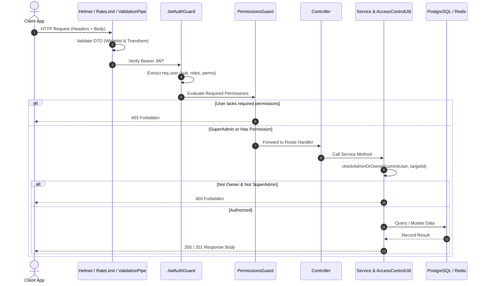

```markdown
<p align="center">
  <a href="https://nestjs.com/" target="blank">
    
  </a>
</p>

<h1 align="center">NestJS Production Auth & RBAC Starter</h1>

<p align="center">
  A clean, battle-tested Authentication & Authorization starter kit built with <b>NestJS 10+</b>, <b>TypeORM</b>, <b>PostgreSQL</b>, and <b>Redis</b>.
</p>

<p align="center">
  
  
  
  
  
  
  
</p>

---

## ⚡ Quick Features

- 👥 **Dual-Entity Architecture**: Separate `users` and `admins` database tables sharing a normalized `BaseAccount` structure.
- 🔑 **Dual-Token JWT Strategy**: Short-lived Access Token (15m) + Long-lived Refresh Token (7d).
- 🛡️ **Fine-Grained PBAC / RBAC**: Route metadata decorators (`@RequirePermissions('users.read')`) evaluated dynamically via `PermissionsGuard`.
- 👑 **SuperAdmin Bypass & Resource Ownership**: Non-admins can only read/mutate their own profile (`sub === targetId`). SuperAdmin bypasses checks.
- 📱 **2FA / TOTP**: RFC 6238 time-based OTP generation, Data URI QR code rendering, and verification with `otplib`.
- 🤖 **Cloudflare Turnstile CAPTCHA**: Server-side cryptographic challenge verification to prevent bot brute-forcing.
- 📍 **Device Tracking & Geo-Alerts**: Automated detection of new browser/OS combinations with geolocation resolution (`geoip-lite`) and background alert emails.
- 🔄 **Safe Soft Deletes & Restores**: TypeORM `deletedAt` lifecycle with zero data loss.
- 🚦 **Redis Rate Limiting & Caching**: Multi-tier throttling via `@nestjs/throttler` backed by Redis storage.
- 📜 **Swagger / OpenAPI**: Auto-generated interactive API documentation with Bearer Auth built-in.

---

## 🏗️ Architecture & Request Flow



---

## 📂 Project Structure

```text
src/
├── app.module.ts                   # Core module loader + Joi env validation
├── main.ts                         # App bootstrap, Helmet, Versioning, Swagger
├── common/
│   ├── decorator/
│   │   ├── current-user.decorator.ts # @CurrentUser() param decorator
│   │   └── permissions.decorator.ts  # @RequirePermissions(...) metadata decorator
│   ├── dto/
│   │   └── pagination.dto.ts       # Pagination query DTO
│   ├── filters/
│   │   └── all-exceptions.filter.ts# Global exception formatting
│   ├── interceptors/
│   │   └── logging.interceptor.ts  # Pino request/response logger
│   └── types/
│       └── jwt-types.ts            # JwtPayload & Express Request interfaces
├── config/
│   ├── namespaces/
│   │   └── jwt.config.ts           # Type-safe JWT configuration
│   └── strategies/
│       ├── jwt-access.strategy.ts  # Access token strategy
│       └── jwt-refresh.strategy.ts # Refresh token strategy
├── modules/
│   ├── admins/                     # Admin management & escalation protection
│   ├── auth/                       # Register, Login, 2FA, Recovery, Device tracker
│   ├── health/                     # Healthcheck endpoints
│   ├── mail/                       # MailService & Handlebars templates
│   ├── permissions/                # Permission registry & PermissionsGuard
│   ├── roles/                      # Role RBAC definitions
│   └── users/                      # User CRUD & profile endpoints
├── templates/                      # Handlebars email templates (.hbs)
└── utils/
    ├── access-control.util.ts      # Multi-tenant resource ownership evaluator
    ├── auth-decorator.util.ts      # Custom class-validator constraints
    └── sanitize.util.ts            # XSS & string trimming transforms
```

---

## 💻 Code Examples

### 1. Granular Permission Guarding
```typescript
@ApiTags('Roles')
@ApiBearerAuth()
@Controller('roles')
@UseGuards(JwtAuthGuard, PermissionsGuard)
export class RolesController {
  constructor(private readonly rolesService: RolesService) {}

  @Post()
  @RequirePermissions('roles.create')
  create(@Body() dto: CreateRoleDto) {
    return this.rolesService.create(dto);
  }

  @Delete(':id')
  @RequirePermissions('roles.delete')
  remove(@Param('id', ParseIntPipe) id: number) {
    return this.rolesService.remove(id);
  }
}
```

### 2. Multi-Tenant Ownership Verification
```typescript
@Get(':id')
findOne(
  @Param('id', ParseIntPipe) id: number,
  @CurrentUser() currentUser: JwtPayload,
) {
  return this.usersService.findOne(id, currentUser);
}

// In UsersService:
async findOne(id: number, currentUser?: JwtPayload): Promise<User> {
  if (currentUser) {
    // Allows if user is SuperAdmin OR owns this specific record
    AccessControlUtil.checkAdminOrOwner(currentUser, id);
  }
  return this.usersRepository.findOne({ where: { id }, relations: ['roles'] });
}
```

### 3. Field-Level Escalation Stripping
```typescript
async update(id: number, dto: UpdateUserDto, currentUser: JwtPayload): Promise<User> {
  AccessControlUtil.checkAdminOrOwner(currentUser, id);

  const isSuperAdmin = AccessControlUtil.isAdmin(currentUser);

  // Strip roleIds so regular users cannot make themselves Admins
  if (!isSuperAdmin) {
    delete dto.roleIds;
  }

  const { password, roleIds, usernameDisplay, ...rest } = dto;
  const user = await this.findOne(id);

  if (usernameDisplay) {
    user.displayName = usernameDisplay;
  }

  Object.assign(user, rest);
  return this.usersRepository.save(user);
}
```

---

## 🚀 Quickstart

### 1. Clone & Install
```bash
git clone https://github.com/your-username/blog-be.git
cd blog-be
npm install
```

### 2. Start PostgreSQL & Redis with Docker
```bash
docker run -d --name blog-postgres \
  -e POSTGRES_USER=postgres \
  -e POSTGRES_PASSWORD=postgres \
  -e POSTGRES_DB=blog_db \
  -p 5432:5432 postgres:16-alpine

docker run -d --name blog-redis \
  -p 6379:6379 redis:7-alpine
```

### 3. Setup Environment Variables
```bash
cp .env.example .env
```

Make sure your `.env` contains:
```ini
NODE_ENV=development
PORT=3000
FRONTEND_URL=http://localhost:5173

# JWT
JWT_ACCESS_SECRET=super_secret_access_key_123456789_min32
JWT_ACCESS_EXPIRY=15m
JWT_REFRESH_SECRET=super_secret_refresh_key_123456789_min32
JWT_REFRESH_EXPIRY=7d

# Database
DB_TYPE=postgres
DB_HOST=127.0.0.1
DB_PORT=5432
DB_USERNAME=postgres
DB_PASSWORD=postgres
DB_NAME=blog_db
DB_SYNCHRONIZE=true

# Redis & Throttler
USE_REDIS=false
REDIS_HOST=localhost
REDIS_PORT=6379

# Mail (e.g. Mailtrap)
MAIL_HOST=sandbox.smtp.mailtrap.io
MAIL_PORT=2525
MAIL_USER=your_user
MAIL_PASS=your_pass
MAIL_FROM="Security Team" <security@example.com>
SUPPORT_EMAIL=support@example.com

# Captcha
CAPTCHA_ENABLED=false
CAPTCHA_SECRET=mock_secret
```

### 4. Run the App
```bash
# Development
npm run start:dev

# Production build
npm run build
npm run start:prod
```

API docs will be available at: **`http://localhost:3000/api`**

---

## 🧪 Testing

The repository features comprehensive E2E tests for every endpoint with automated DB isolation and third-party mocks:

```bash
# Run all E2E test suites
npm run test:e2e

# Run individual domain suites
npx jest --config ./test/jest-e2e.json test/auth.e2e-spec.ts
npx jest --config ./test/jest-e2e.json test/users.e2e-spec.ts
npx jest --config ./test/jest-e2e.json test/admins.e2e-spec.ts
npx jest --config ./test/jest-e2e.json test/roles.e2e-spec.ts
npx jest --config ./test/jest-e2e.json test/permissions.e2e-spec.ts
```

---

## 📋 Codebase Audit & TODO List

The following items are specific fixes and improvements flagged from the codebase:

- [ ] **Fix typo in `main.ts` shutdown logic**:
  ```typescript
  // ❌ main.ts:
  if (configService.get<string>('NODE_ENV', 'devedadlopment') === 'dad') {
    setupGracefulShutdown({ app });
  }
  // ✅ Change to:
  if (isProd) {
    setupGracefulShutdown({ app });
  }
  ```
- [ ] **Add `displayName` to `RegisterDto`**:
  `RegisterDto` currently only has `username`, `email`, `password`, `captchaToken`. Add `@IsOptional() @IsString() displayName?: string;` so registration doesn't discard custom display names.
- [ ] **Implement Cleanup Hook in `app.module.ts`**:
  Fill in the empty `cleanup` function inside `GracefulShutdownModule.forRoot()` to gracefully close Redis and TypeORM connection pools before SIGTERM exit.
- [ ] **Add BullMQ for Background Email Queueing**:
  `MailService.sendPasswordResetEmail()` and `sendNewDeviceAlert()` currently run inside the HTTP process. Move them to a Redis queue so slow SMTP servers never block API throughput.
- [ ] **Refresh Token Blacklisting**:
  Add a Redis token revocation table (`SET token:revoked EX 604800`) to instantly invalidate refresh tokens on password reset or explicit logout.
- [ ] **Set up TypeORM Migration Scripts**:
  Transition away from `DB_SYNCHRONIZE=true` to standard migrations (`npm run migration:generate` / `npm run migration:run`) for safe production deployments.
```
